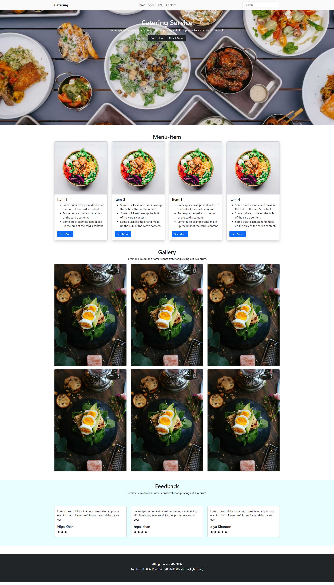

# 🍽️ Catering Service Website

A modern, responsive, and user-friendly Catering Service Website built using HTML5, CSS3, Bootstrap 5, and JavaScript. This project demonstrates a clean UI with responsive layouts and essential sections for a catering business.

---

## 📸 Preview

> Home Page



---

## 🚀 Features

- Responsive Navigation Bar
- Hero Banner with Call-to-Action Buttons
- Menu Items Section
- Food Gallery
- Customer Feedback Section
- Contact Page
- FAQ Page
- Responsive Design
- Clean and Modern User Interface
- Cross-browser Compatible

---

## 🛠️ Built With

- HTML5
- CSS3
- Bootstrap 5
- JavaScript

---

## 📂 Project Structure

```
Catering-Service/
│
├── index.html
├── about.html
├── contact.html
├── faq.html
│
├── css/
│   └── style.css
│
├── js/
│   └── script.js
│
├── images/
│   ├── home Page.jpg
│   ├── about page.png
│   ├── FAQ .png
│   └── contact.png
│
└── README.md
```

---

## 📱 Responsive Design

This website is fully responsive and works smoothly on:

- Desktop
- Laptop
- Tablet
- Mobile Devices

---

## 🎯 Sections Included

- Home
- About
- Menu Items
- Gallery
- Customer Feedback
- FAQ
- Contact
- Footer

---

## 💡 Purpose

This project was created to practice front-end web development and demonstrate responsive website design using Bootstrap and JavaScript.

---

## 👩‍💻 Author

**Arifa Khatun**

Frontend Web Developer

### Skills

- HTML5
- CSS3
- Bootstrap 5
- JavaScript
- WordPress
- Elementor

 ## 🌐 Live Demo

https://arifa-codes.github.io/Catering-website/

## ⭐ If you like this project

Give this repository a ⭐ on GitHub.
